<font size="6"> <strong> Developer Guide </strong> </font>

# Introduction

Wiagi is a simple command line application that helps students who are beginning their financial
independence journey by offering a wide range of essential tools and features such as budgeting, saving,
and investment analysis.

<!-- TOC -->
* [Introduction](#introduction)
* [Acknowledgements](#acknowledgements)
* [Design & implementation](#design--implementation)
  * [Architecture Diagram](#architecture-diagram)
    * [Main components of the architecture](#main-components-of-the-architecture)
      * [Wiagi class](#wiagi-class)
  * [Data Types and Structures](#data-types-and-structures)
    * [EntryType Class](#entrytype-class)
    * [Income class](#income-class)
    * [Spending class](#spending-class)
    * [IncomeList class](#incomelist-class)
    * [SpendingList class](#spendinglist-class)
    * [Recurrence Class](#recurrence-class)
    * [RecurrenceFrequency enumeration](#recurrencefrequency-enumeration)
    * [Storage Class](#storage-class)
      * [Motivation behind the class](#motivation-behind-the-class)
      * [How the Storage works](#how-the-storage-works)
  * [Program start up](#program-start-up)
    * [Loading storage](#loading-storage)
      * [load method in `IncomeListStorage` `SpendingListStorage`](#load-method-in-incomeliststorage-spendingliststorage)
      * [load method in `LoginStorage`](#load-method-in-loginstorage)
    * [Recurrence Updating](#recurrence-updating)
      * [How recurrence updating works](#how-recurrence-updating-works-)
      * [Implementation](#implementation)
        * [checkIncomeRecurrence / checkSpendingRecurrence method](#checkincomerecurrence--checkspendingrecurrence-method)
        * [parseRecurrence method](#parserecurrence-method)
        * [updateRecurrence method](#updaterecurrence-method)
        * [checkIfDateAltered method](#checkifdatealtered-method)
      * [Here are some things to take note](#here-are-some-things-to-take-note)
  * [Program run sequence](#program-run-sequence)
    * [Command handling](#command-handling-)
    * [Storage saving](#storage-saving)
      * [save method in `IncomeListStorage` `SpendingListStorage`](#save-method-in-incomeliststorage-spendingliststorage)
    * [Adding a new entry](#adding-a-new-entry)
      * [Recurrence backlogging](#recurrence-backlogging)
        * [How the recurrence backlogging works](#how-the-recurrence-backlogging-works)
        * [Implementation](#implementation-1)
          * [checkRecurrenceBacklog method](#checkrecurrencebacklog-method)
          * [hasRecurrenceBackLog method](#hasrecurrencebacklog-method)
    * [Editing entries](#editing-entries)
    * [Finding entries](#finding-entries)
    * [Deleting entries](#deleting-entries)
    * [Setting a budget](#setting-a-budget)
    * [Listing entries](#listing-entries)
      * [Listing all entries](#listing-all-entries)
      * [Listing spendings](#listing-spendings)
      * [Listing incomes](#listing-incomes)
      * [Listing tags](#listing-tags)
        * [Listing all tags](#listing-all-tags)
        * [Listing all entries with a specific tag](#listing-all-entries-with-a-specific-tag)
    * [Help command](#help-command)
    * [Bye command](#bye-command)
* [Appendix: Requirements](#appendix-requirements)
  * [Product scope](#product-scope)
    * [Target user profile](#target-user-profile)
    * [Value proposition](#value-proposition)
  * [User Stories](#user-stories)
  * [Use cases](#use-cases)
    * [Use case: Add an Entry](#use-case-add-an-entry)
    * [Use case: Delete an Entry](#use-case-delete-an-entry)
    * [Use case: Listing all Entries](#use-case-listing-all-entries)
    * [Use Case: Edit an Entry](#use-case-edit-an-entry)
    * [Use Case: Adding a Budget](#use-case-adding-a-budget)
    * [Use Case: Find an Entry](#use-case-find-an-entry)
    * [Use Case: Getting information of commands](#use-case-getting-information-of-commands)
  * [Non-Functional Requirements](#non-functional-requirements)
  * [Future plans](#future-plans)
  * [Glossary](#glossary)
* [Appendix: Instructions for manual testing](#appendix-instructions-for-manual-testing)
  * [Creating a new user](#creating-a-new-user)
  * [Finding an entry](#finding-an-entry)
  * [Editing an Entry](#editing-an-entry)
  * [Showing help](#showing-help)
  * [Setting a Budget](#setting-a-budget-1)
  * [Adding an income or spending](#adding-an-income-or-spending)
  * [Exiting the program](#exiting-the-program)
<!-- TOC -->


# Acknowledgements

Sources of all reused/adapted ideas, code, documentation, and third-party libraries:

[Original Source](https://github.com/nus-cs2113-AY2425S1/tp)

# Design & implementation

## Architecture Diagram
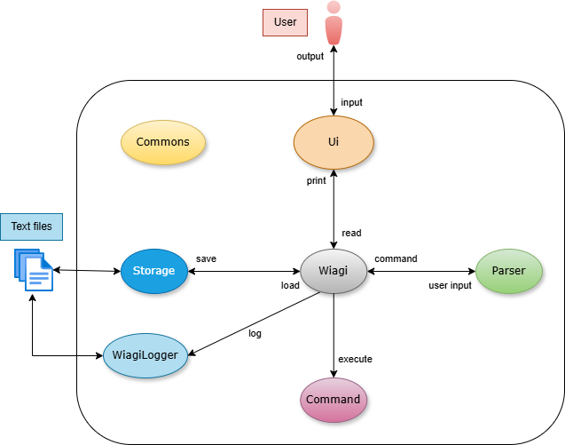<br>
The Architecture Diagram given above explains the high-level design of the program.

Given below is a quick overview of main components and how they interact with each other.

### Main components of the architecture
1. `Wiagi`: The command executor and brain of the program.
   - At program launch, it initializes components, such as `WiagiLogger` and `Storage`, ensuring that the user data is
          loaded securely.
   - It will then repeatedly read in user commands with `Ui`, parse input with `Parser` and executes them accordingly
     with `Command`.
   - When a shut-down command is initiated by the user, the program is exited safely.
2. `Ui`: Takes in user input and prints output of the program.
   - Provides a wide variety of output formats, enabling it to work with different components. 
3. `Parser`:  Parse user input to deduce their intended command.
   - Returns a `Command` object to `Wiagi` based on the user input.
4. `Command`: Represents a collection of command classes with different functionalities.
5. `Storage`: Reads data from files and writes data to files.
6. `WiagiLogger`: Tracks events that happened when the program runs.

#### Wiagi class

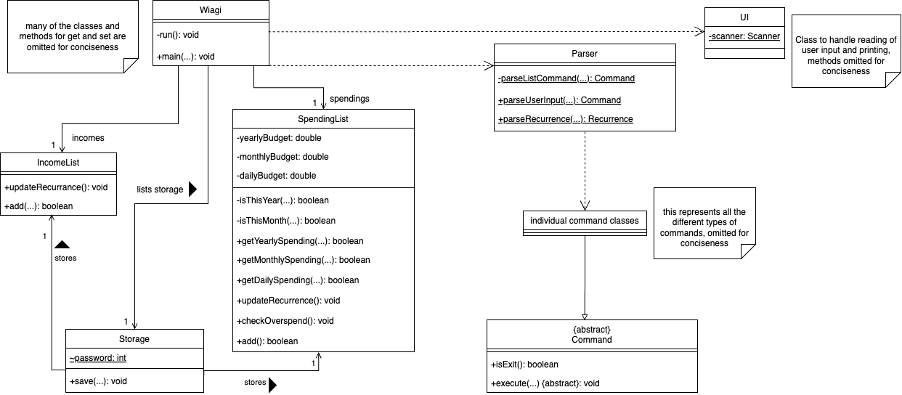
<br>
On a high level, whenever `Wiagi` is started, it will load `SpendingList` and `IncomeList` from `Storage` if they exist, 
else, new lists would be created. It will also load the hashed password from `Storage` if it exists, else it will
prompt the user to create a new account. The hashed password is checked against the user's password input for verification.
`Wiagi` then takes in user input via the `Ui` class, then parse and executes the command through the `Parser` class.
The related output is printed through the `Ui` class.
Now let's delve deeper into some of these classes used for the program below

## Data Types and Structures
This section introduces the common classes used throughout the program their internal implementations and structure.

### EntryType Class
The `EntryType` class is a class that is used for storing different types of user entry such that the entries
contain the relevant information required by other classes to perform their tasks. <br>

The following are its attributes: <br>
+ `amount` 
  + type: `double`
  + stores the amount for the entry
+ `description`
  + type: `String`
  + stores the description of the entry
+ `date`
  + type: `LocalDate`
  + stores the date of entry
+ `tag`
  + type: `String`
  + stores the tag name linked to the entry
+ `recurrenceFrequency`
  + type: [`RecurrenceFrequency`](#recurrencefrequency-enumeration)
  + stores the frequency of recurrence for the entry
+ `lastRecurrence`
  + type: `LocalDate`
  + stores the date the entry was last recurred for internal program checking usage
+ `dayOfRecurrence`
  + type: `int`
  + stores the day of it own private attribute `date`, used for internal program checking usage

The methods implemented in this class are a collection of getters and setters that allow other class types to access
the information of the entry.

The following are child classes of `EntryType`:
+ `Income`
+ `Spending`

### Income class
The `Income` class inherits from `EntryType` class. It is used to store relevant information for entries labelled as
income. This information is used by other classes to perform their tasks.

### Spending class
The `Spending` class inherits from `EntryType` class. It is used to store relevant information for entries labelled as
spending. This information is used by other classes to perform their tasks.

### IncomeList class
The `IncomeList` class inherits from the `ArrayList` class. It is used to store all of the `Income` objects used in the
program.

### SpendingList class
The `SpendingList` class inherits from the `ArrayList` class. It is used to store all of the `Spending` objects used in
the program. Additionally, it stores the budgets that are set by the user.

### Recurrence Class
The purpose of the class are as follows:
+ Allows the user to set specific expenditure and incomes as recurring events to increase efficiency when using the
  application
+ Users may have differing frequencies for recurring events thus application gives them a few common options
+ Users may also want to add multiple older recurring entries that have been missed out for a while

Illustrated below is the class diagram for the Recurrence class:<br>
<br>
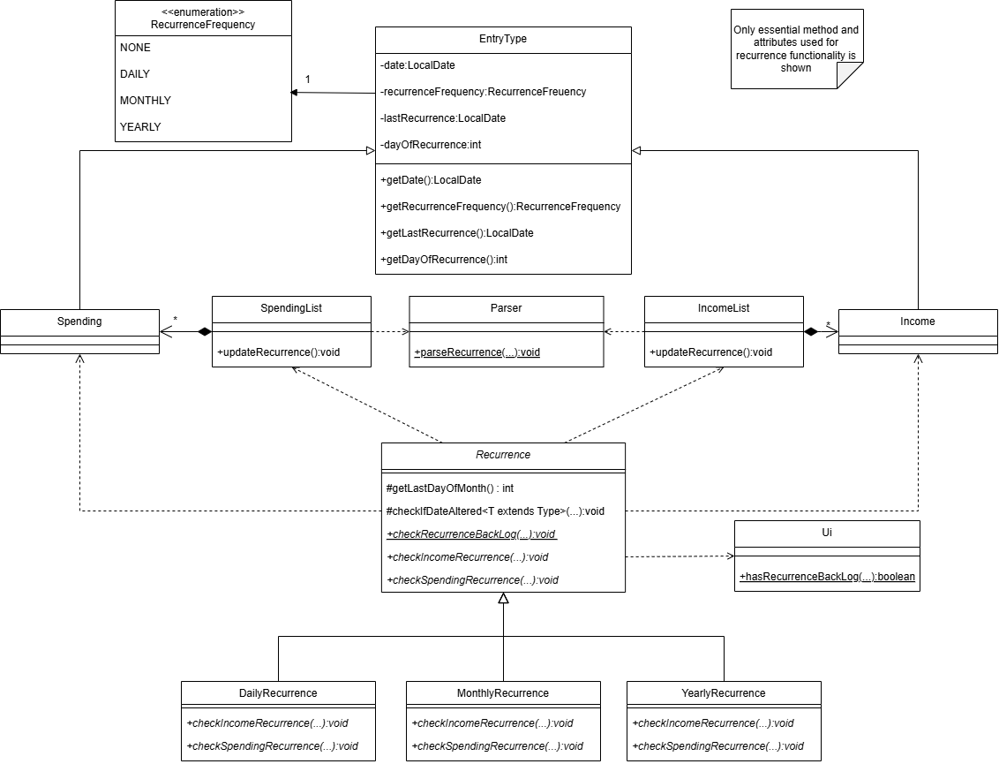
<br>
<br>

The `Recurrence` class is an abstract class that provides the interface for checking `Income` and `Spending` and adding
recurring entries into the list. <br>

The following are child classes of `Recurrence`:
+ `DailyRecurrence`: Handles entries labelled as daily recurring events
+ `MonthlyRecurrence`: Handles entries labelled as monthly recurring events
+ `YearlyRecurrence`: Handles entries labelled as yearly recurring events

Recurrence happens during 2 use cases:
+ Recurrence updating of existing entries during start up.
+ Recurrence backlogging when an entry with recurrence dated to the past is added using 
[add command](#adding-a-new-entry-)

Method implementations will be explained in later parts, in their respective use cases

### RecurrenceFrequency enumeration
The `RecurrenceFrequency` enumeration is used to determine the type of recurring entry of `EntryType` and its child
classes, stored in the `recurrenceFrequency` attribute <br>
Enumeration constants:
+ `NONE`: Represents not recurring entry
+ `DAILY`: Represents a daily recurring entry
+ `MONTHLY`: Represents a monthly recurring entry
+ `YEARLY`: Represents a yearly recurring entry


### Storage Class
#### Motivation behind the class
+ Allows the user to save changes, so that they can resume where they left off.
+ Allows advanced users to edit files directly, enabling fast, manual adjustments.

#### How the Storage works
The `Storage` class is a class that stores `incomes`, `spendings` and `password`. 
Upon instantiation, it will call `IncomeListStorage.load()`, `SpendingListStorage.load()` and `LoginStorage.load()`, which will initialise the variables in `Storage` respectively. It will also call upon `IncomeListStorage.save()` and `SpendingListStorge.save()` to save the user data into its respective data files. 

+ Variables and File Path:
    + `incomes` → `./incomes.txt`
    + `spendings` → `./spendings.txt`
    + `password` → `./password.txt`

Method implementations will be explained in later parts, in their respective use cases

## Program start up

### Loading storage

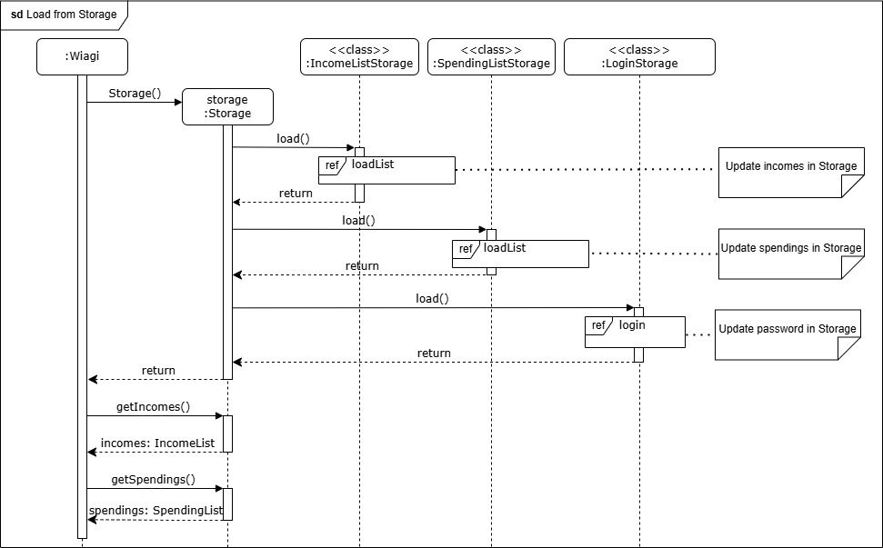<br>
To load saved lists:
+ It is done upon program startup, when `Wiagi` is constructed.
+ Within the `Wiagi` constructor, it will create a new instance of `Storage`, which will then load the data at the 
  `incomes` and `spendings` file paths to an `IncomeList` and `SpendingList` respectively.
+ `Wiagi` will then retrieve the lists in `Storage` to initialise its lists.
+ Data corruption in the file triggers an exception, often due to user-editing error.
+ For missing incomes and spendings files (e.g., new users), files are created and the initialised lists will be empty.

To load password:
+ The hashed password will be loaded from the password file.
+ For missing password file (e.g., new users), users will be prompted to set a new password at the start of the program. 
The entered password will then be hashed and stored in a newly created password file.


#### load method in `IncomeListStorage` `SpendingListStorage`
<br>
+ Both classes have similar implementation for `load()`, except that `SpendingListStorage` also loads budget details.
+ A while loop will loop through the file with a scanner to read line by line till the end of the file is reached.
+ It splits each line by '`|`' to access each attributes, converts each attribute to its respective type and adds it to its respective list.
+ During the process, if a line is corrupted, an exception will be caught and user will be informed of the line number.


#### load method in `LoginStorage`
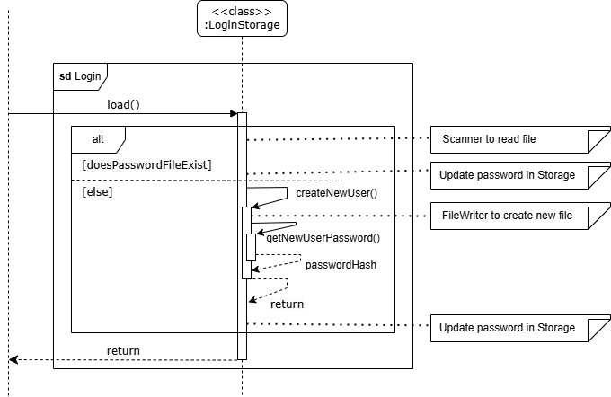<br>
+ It first checks if the password file exists.
  + If it exists, it will use a `Scanner` to read the file and initialise `password` attribute in `Storage`.
  + Else, it will call `createNewUser()`, which creates a new password file and use `getNewUserPassword()` to scan for
  the user input. Then, it will be hashed, stored in the file, and be used to initialise `password` attribute in `Storage`.

### Recurrence Updating
Below illustrates the reference frame of recurrence updating <br>
<br>
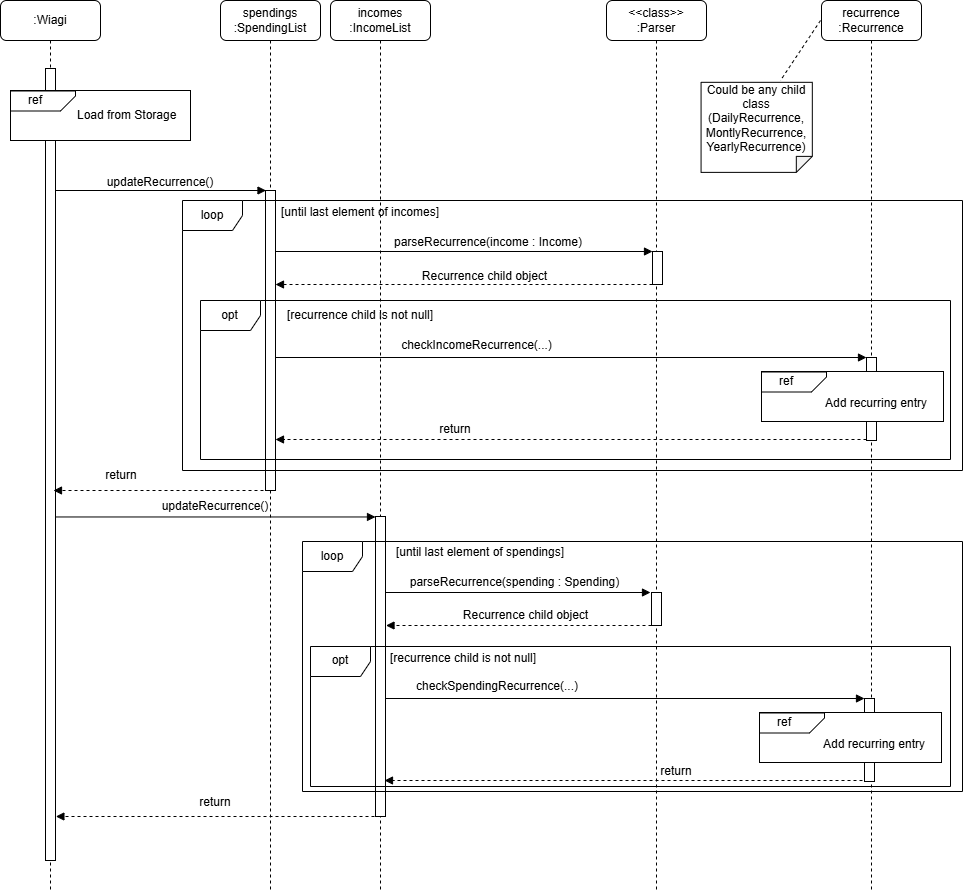
<br>
For the reference frame of 'load from storage', it is as explained previously in [load](#load-method-in-incomeliststorage-spendingliststorage) method. <br>
For the reference frame of 'add recurring entry', refer to
[checkIncomeRecurrence / checkSpendingRecurrence](#checkincomerecurrence--checkspendingrecurrence-method) method. <br>

#### How recurrence updating works 
+ Upon running the application by the user, `Storage` component will load the `IncomeList` and `SpendingList` members of
  `Wiagi` to retrieve past data.
+ `updateRecurrence()` is called.
+ Both `SpendingList` and `IncomeList` are then iterated through. Each member of the lists is parsed through
  `Parser#parseRecurrence()` which returns the type of recurrence it is (e.g. `DailyRecurrence`, `null`)
  which is encapsulated as a `Recurrence` object.
+ If `Recurrence` is not `null` (i.e. a recurring entry), it checks the entry and adds to the `SpendingList` and
  `IncomeList` if needed via `Recurrence#checkIncomeRecurrence()` or `Recurrence#checkSpendingRecurrence()`. <br>

#### Implementation
The following are notable classes and methods used to achieve recurrence updating.

##### checkIncomeRecurrence / checkSpendingRecurrence method
Class: `DailyRecurrence`, `MonthlyRecurrence`, `YearlyRecurrence` <br>
Method Signature: <br>
```
@Override
public void checkIncomeRecurrence(Income recurringIncome, IncomeList incomes, 
boolean isAdding)
@Override
public void checkSpendingRecurrence(Spending recurringSpending, 
SpendingList spendings, boolean isAdding)
```
Below illustrates the functionality of the checkIncomeRecurrence method through a sequence diagram <br>
<br>
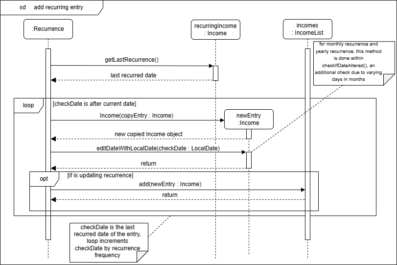 <br>
Since checkSpendingRecurrence method follows the same sequence as checkIncomeRecurrence method, the diagram is omitted
for conciseness.

Functionality: <br>
1. Checks `lastRecurrence` attribute of `recurringIncome`/`recurringSpending`(i.e. entry to check) against the current date
   via `LocalDate.now()`
2. According to the type of recurrence, loops `lastRecurrence` with the frequency incrementally
3. Adds a recurring entry each time into the `IncomeList`/`SpendingList` if date is still of the past.
4. isAdding is set to `true` for recurrence updating to allow adding of entries, it may be set to `false` for
   backlogging as seen later to only update `lastRecurrence` attribute to the latest possible recurring date to
   be checked against in the future for recurrence updating

##### parseRecurrence method
Class: `Parser` <br>
Method Signature: <br>
```
public static Recurrence parseRecurrence(EntryType entry)
```
Functionality: <br>
1. Takes in child class of `EntryType` (i.e. `Spending`, `Income`)
2. Matches the `reccurenceFrequency` attribute with switch case to determine which `Recurrence` child to return
3. Returns `DailyRecurrence`, `MonthlyRecurrence`, `YearlyRecurrence` or `null`(If not a recurring entry) accordingly.

##### updateRecurrence method
Class: `SpendingList`, `IncomeList` <br>
Method Signature:
```
public void updateRecurrence()
```
Functionality: <br>
1. Loops through the list and calls upon `Parser#parseRecurrence()` to determine type of `Recurrence`
2. Calls upon `Recurrence#checkSpendingRecurrence()` or `Recurrence#checkIncomeRecurrence()` to update list if the new
   recurring entry is supposed to be added

##### checkIfDateAltered method
Class: `DailyRecurrence`, `MonthlyRecurrence`, `YearlyRecurrence` <br>
Method Signature:
```
protected <T extends EntryType> void checkIfDateAltered(T newEntry, 
LocalDate checkDate, ArrayList<T> list, boolean isAdding)
```
Functionality: <br>
1. Get the actual day (e.g. 31st) of supposed recurrence from `dayOfRecurrence` attribute of entry
2. Get the last day of the current month
3. Return the date with the minimum of the 2 to ensure that date of recurrence is valid


#### Here are some things to take note
+ Recurrence updating of entries is only added when user logs in, which is not determinable, thus many additional 
entries may be added at once (e.g. user last logged in 4 days ago with one daily recurring entry in the list. When the 
user logs in, 4 days of entries will be added). 
+ Additional entries added by `Recurrence` are being set to not recurring events to prevent double recurring entries
  added in the future
+ Here is a scenario of why `dayOfRecurrence` is tracked:
    + Monthly recurring entry dated at 31st August
    + Since September ends on the 30th, recurring entry is added on the 30th September and `lastRecurrence` is stored as
      30th September
    + `dayOfRecurrence` is used to track the real date of recurrence since the day will be overwritten
    + However, due to varying days in months, `checkIfDateAltered()` is used to validate the date of entry


## Program run sequence

### Command handling 

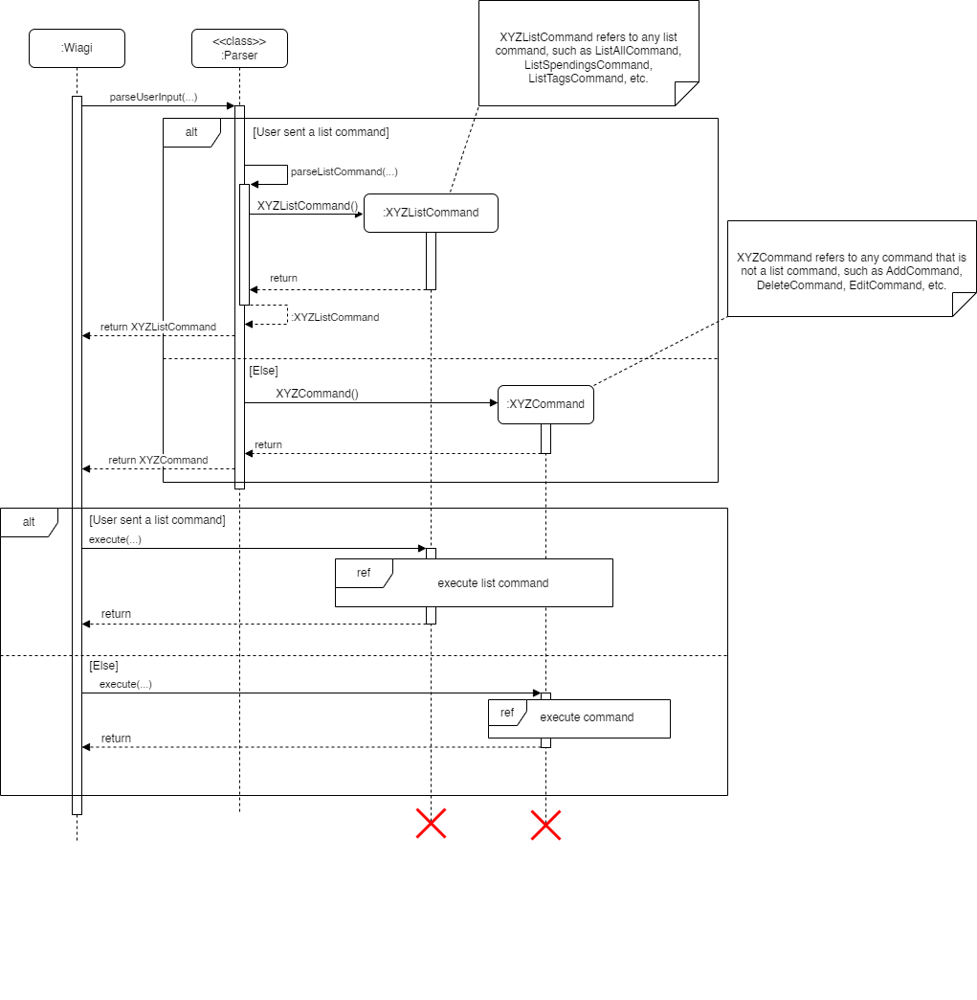

User input is taken in through the `Ui.readCommand()` method that is called from the `Wiagi` class. This command is 
then passed to the static method `Parser#parseUserInput()`. This method determines the command type 
based on the command word, and returns a new instance of the respective command, as shown in the 
sequence diagram above.

Since there are various list commands that the user can execute, the list commands are split into multiple classes.
If the command word is `list`, the parser will call a separate method `parseListCommand()` that will return the correct list command. <br>

After the correct command is returned, it is executed by Wiagi by calling the `execute()` method of the command. <br>

The referenced sequence diagram for the execution of list commands will be shown in the section for [listing entries](#listing-entries),
while the referenced sequence diagram for the execution of commands will be shown in the sections for
[adding a new entry](#adding-a-new-entry) and [editing entries](#editing-entries), which will serve as examples since the
execution of most commands will be similar.

The diagram below shows the class diagram for a command.

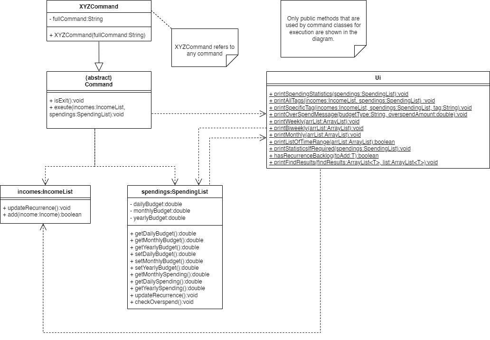

### Storage saving

To save edited lists:
+ It is done when users type `bye` or after keyboard interrupts (i.e.Ctrl-c), which signals the end of the program.
+ The lists are saved to a user-editable format in their respective files.

#### save method in `IncomeListStorage` `SpendingListStorage`
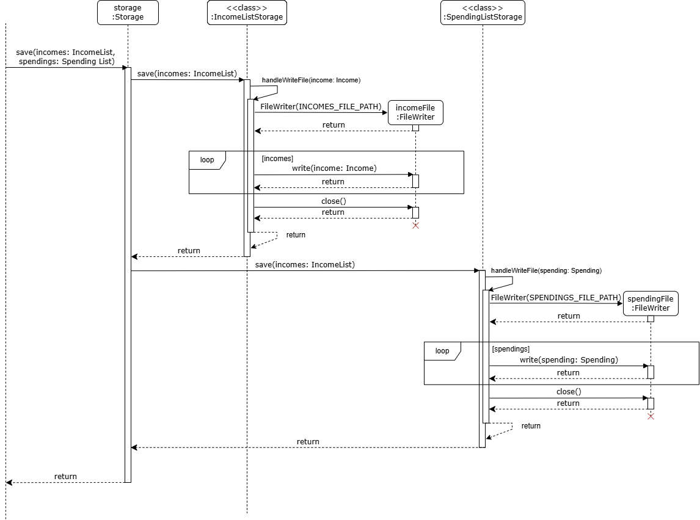<br>
Both classes have similar implementation for `save()`, except that `SpendingListStorage` saves budget details in the 
first line of its text file.
+ Format: `daily budget | monthly budget | yearly budget`
+ A for loop will loop through the list, and get each of the attributes of each entry within it and separate them by 
`|`. Hence, each entry will be written line by line to the file.
+ Format: `amount | description | date | tag | recurrence frequency | last recurrence date | day of recurrence`
  + E.g. `add income 10 part time /2024-10-10/ *job* ~monthly~` will be stored as
    `10.0|part time|2024-10-10|job|MONTHLY|2024-10-10|10`


### Adding a new entry
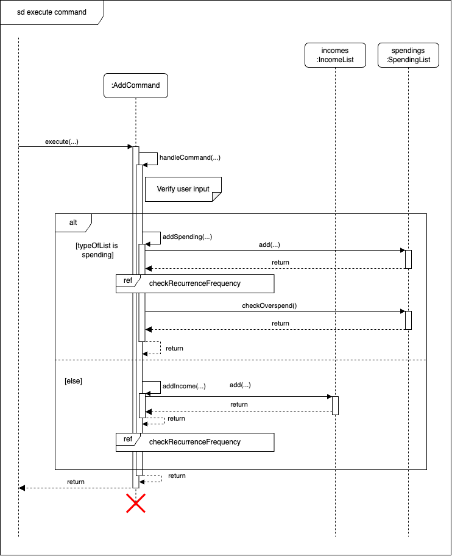
<br>
To add new entries, user will have to input the related commands. The sequence diagram above shows the flow of adding a new entry.
`handleCommand()` method in `AddCommand` class will be called to verify the user input and handle the command.
The entries will be added to the respective list and the user will be informed that the entry has been added.

#### Recurrence backlogging
Illustrated below is the reference frame recurrence backlogging when a recurring entry dated before the current
day is added <br>

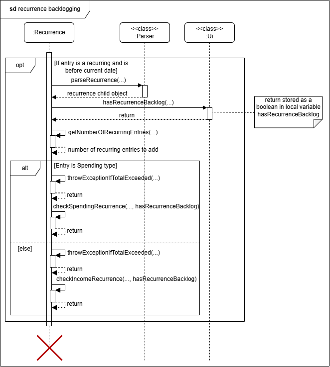 <br>

##### How the recurrence backlogging works
+ Upon adding an entry with recurrence dated to the past, the `Ui#hasRecurrenceBacklog()` method will be called to get
  user input on whether to backlog
+ According to the user input, `Recurrence#checkIncomeRecurrence()` or `Recurrence#checkSpendingRecurrence()` will be
  called to update the `lastRecurrence` attribute of the entry as well as add recurring entries from the entry date to
  current date if user wishes to
+ An error will be thrown to the user if the total amount to be added from all the recurrence entries cause the `total`
attribute of `SpendingList` or `IncomeList` to exceed its limit

##### Implementation
The following are notable methods used to achieve recurrence backlogging. Methods[`Recurrence#checkIncomeRecurrence()`,
`Recurrence#checkSpendingRecurrence()`](#checkincomerecurrence--checkspendingrecurrence-method) and 
[`Parser#parseRecurrence()`](#parserecurrence-method) explained in updating recurrence above are re-used and
thus will be omitted below for conciseness

###### checkRecurrenceBacklog method
Class: `Recurrence` <br>
Method Signature: <br>
```
public static <T extends EntryType> void checkRecurrenceBackLog(T toAdd,
 ArrayList<T> list)
```
Functionality:
1. Calls upon `Parser#parseRecurrence()` method to determine the type of recurrence
2. Calls its own method `getNumberOfRecurringEntries()` to obtain total recurring entries to be added
3. Ask if user wishes to backlog all the past entries from date of entry to current date via
   `Ui#hasRecurrenceBacklog` which returns a boolean, `true` if user inputs yes, else `false`.
4. Calculates the total amount to be added using its own method `throwExceptionIfTotalExceeded()` and throws an error if
`total` attribute of `SpendingList` or `IncomeList` exceeds limit after adding entries
5. Updates the `lastRecurrence` attribute of the entry to facilitate future adding of recurrence and if boolean is true,
   also adds backlog entries to `IncomeList` or `SpendingList` via [`Recurrence#checkIncomeRecurrence` and
   `Recurrence#checkSpendingRecurrence`](#checkincomerecurrence--checkspendingrecurrence-method)

###### hasRecurrenceBackLog method
Class: `Ui` <br>
Method Signature:
```
public static <T extends EntryType> boolean hasRecurrenceBacklog(T toAdd)
```
Functionality:
1. Query for user input via `Ui#readCommand()` on whether he/she wishes to backlog recurring entries
2. Returns `true` if users input yes or `false` otherwise

### Editing entries
`EditCommand` validates and parses the given input to determine if it is editing a spending or an income. It then
extracts the entry from its corresponding list (SpendingList or IncomeList). Finally, it uses the parsed input to
determine which attribute to edit and sets this attribute of the extracted entry to the new value.

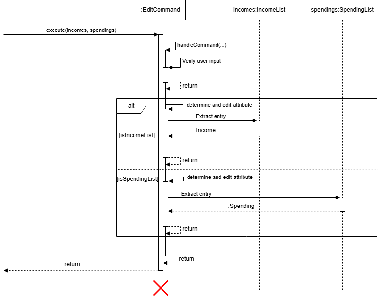 <br>

### Finding entries
`FindCommand` validates and parses the given input to determine if it is finding entries in a `SpendingList` or an 
`IncomeList`. It then searches through the list based on specified fields (`amount`, `description`, or `date`) 
to display matching results.

### Deleting entries
`DeleteCommand` validates and parses the given input to determine if it is deleting a spending or an income. It then
deletes the entry from the respective list (SpendingList or IncomeList) by calling the delete method of that list.

### Setting a budget
`BudgetCommand` first validates and parses the given input. It then determines whether the user wants to add a daily
, monthly, or yearly budget. It then calls the respective method of the SpendingList to set the correct budget.

### Listing entries

Since listing requires Wiagi to print items in the spendings and incomes list, the printing will be handled by the Ui 
class.

#### Listing all entries

When the user requests to list all entries, the program prints all entries in both `incomes` and 
`spendings` by looping through both lists and printing them out with their index.

#### Listing spendings

When users request to list all spendings, they are given the option to choose a time range from the following options:
1. All
2. This week
3. Last week and this week
4. This month

By selecting options 2, 3, or 4, only the spending entries 
that are dated within the current week, last week and this week, or current month will be displayed.

If the user chooses to list all spendings, they are then given the option to display all
statistics, which consist of:
- Daily spendings
- Daily budget
- Daily budget left
- Monthly spendings
- Monthly budget
- Monthly budget left
- Yearly spendings
- Yearly budget
- Yearly budget left

The sequence diagram below shows what happens when the user executes a `list spending` command.

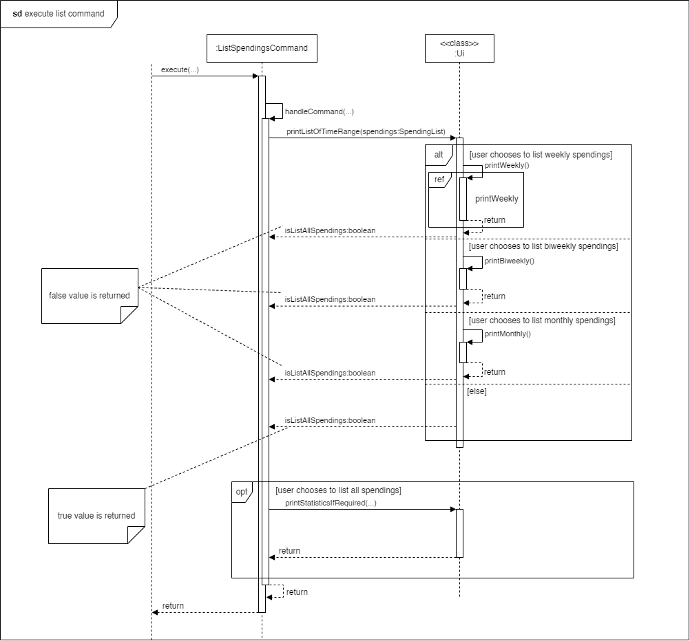

As shown in the diagram, when the command is executed, a `handleCommand(...)` method is first called to verify the user 
input and handle the command. 

Within this method, a static method `printListofTimeRange` is called to 
allow the user to select a time range. This method returns a boolean value that is `true` if the user has selected to list 
all spendings and `false` otherwise. If this returned value is `true`, another static method `printStatisticsIfRequired` is 
called to allow the user to choose whether to show all spending statistics and print the list accordingly.

The sequence diagram below shows what happens when the user chooses to show their weekly spendings.

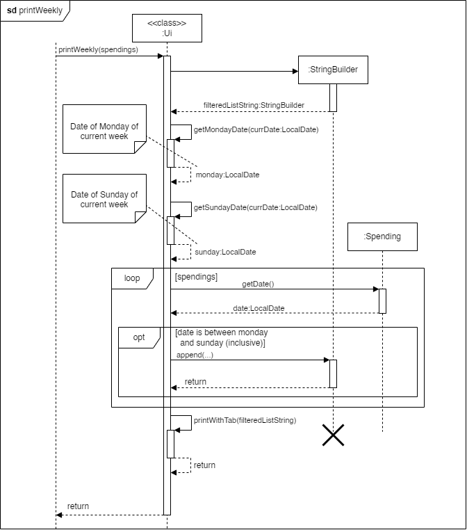

As shown in the diagram, the program gets the dates of the Monday and Sunday of the current week. It then loops through
the spending list. For every entry in the spending list, it checks whether the date of the entry is between the Monday
and the Sunday of the current week (inclusive), and if it is, the entry will be appended to a string along with its 
index. Finally, the string is printed. 

#### Listing incomes

When users request to list incomes, they are also given the option to choose from the same 4 time ranges:
1. All
2. This week
3. Last week and this week
4. This month
 
By selecting options 2, 3, or 4, only the spending entries
that are dated within the current week, last week and this week, or current month will be displayed.

The implementation of listing incomes is very similar to that of listing spendings, except that users will not be
given the option to list statistics if they choose to list all incomes. Hence, the sequence diagram is omitted for this
command.

#### Listing tags

Listing all tags and listing all entries with a specific tag are grouped together into one command called 
`ListTagsCommand`. When this command is executed, the number of words in the command is checked to determine if the user
wants to list all tags or to list all entries with a specific tag, as shown in the sequence diagram below. 


##### Listing all tags

For listing all tags, the static method `printAllTags()` from the `Ui` class is called. This method simply loops 
through all entries and gets an `ArrayList` of all the unique tags before printing them out. 

##### Listing all entries with a specific tag

For listing entries with a specific tag, the static method `printSpecificTag()` from the `Ui` class is called. This
method is similar to the `printWeekly()` method as it also loops through spendings and incomes while appending 
entries with the specified tag to a `String` which is then printed out. 

### Help command

When the user types `help`, the program will print out a list of commands that the user can use. 

### Bye command

When the user types `bye`, the program will exit.

# Appendix: Requirements
## Product scope
### Target user profile
1. User prefers desktop apps over other types (i.e. online apps)
2. User is reasonably comfortable using CLI apps
3. User wants to manage their own finances better
4. User is a quick typist who prefers typing over using the mouse

### Value proposition
An app that help students to manage their financials faster than a typical mouse/GUI driven app.

## User Stories
Priorities: High (must have) - * * *, Medium (nice to have) - * *, Low (unlikely to have) - *

| Priority | As a ...                                          | I want to ...                                        | So that I can ...                                      |
|----------|---------------------------------------------------|------------------------------------------------------|--------------------------------------------------------|
| ***      | user                                              | start and close the application                      | use it only when needed                                |
| ***      | user                                              | add my financial transactions                        | track the flow of my money                             |
| ***      | user                                              | categorise my entries as income and spendings        | better understand my financials                        |
| ***      | user                                              | add income and expenditure categories                | see my overall net gain or loss                        |
| ***      | user                                              | see all my spendings                                 | know what I spent on                                   |
| ***      | user                                              | delete my entries                                    | correct my mistakes                                    |
| ***      | user                                              | have a password to my account                        | protect my account information                         |
| **       | user                                              | edit my incomes and spendings                        | correct my mistakes                                    |
| **       | user                                              | categorise my expenses                               | see what I spend on                                    |
| **       | user                                              | categorise my incomes                                | see where my savings come from                         |
| **       | user                                              | read the amount of money left in my allocated budget | gauge how much to spend for the remaining period       |
| **       | user                                              | set expenses and incomes as recurring                | do not need to manually add them each time             |
| **       | user                                              | set budgets for each category of expense             | make better financial decisions                        |
| **       | user                                              | view my expenses in different time ranges            | better analyse my spendings                            |
| **       | user subscribed to multiple subscription services | set expenses as recurring                            | automate the process of adding entries                 |
| **       | new user                                          | view usage instructions                              | refer to them when I forget how to use the application |
| *        | user                                              | be alerted when I overspend my budget                | try to curb my spendings                               |
| *        | user                                              | find my entry with keywords                          | retrieve specific entries easily                       |


## Use cases

### Use case: Add an Entry

**Adding an income entry with optional input for date, tag and recurrence frequency**

**MSS**

1. User inputs to add income with description, amount, date, tag and recurrence frequency.
2. Wiagi adds the income to the income list.
3. If the date is not provided, Wiagi will use the current date.
4. If the tag is not provided, Wiagi will use the default tag (Empty String).
5. Wiagi will display a message to the user that the income has been added.

Use case ends.

**Extensions**
1. User enters invalid input.
   1. If the user inputs invalid ordering, Wiagi will display an error message.
   2. If the user inputs an invalid amount, Wiagi will display an error message.
   3. If the user inputs an invalid date, Wiagi will display an error message.
   4. If the user inputs an invalid recurrence frequency, Wiagi will display an error message.
   5. If the user inputs an invalid tag, Wiagi will display an error message.
   
   Use case restarts at step 1.

### Use case: Delete an Entry

**Deleting an income or spending from the list**

**MSS**

1. User requests to list all incomes
2. Wiagi shows a list of all incomes
3. User takes note of the index of the income to delete and requests to delete the entry
by specifying the index
4. Wiagi deletes the entry
  
Use case ends.

**Extensions**
- 1a. The list is empty. 
<br>Use case ends. 
- 3a. The given index is invalid.
  - 3a1. Wiagi displays an error message.
<br>Use case restarts at step 1.


### Use case: Listing all Entries
**MSS**
1. User requests to list all entries.
2. Wiagi shows a list of all incomes and spendings, including optional parameters such as tags and recurrence frequency.

Use case ends. <br>

**Extensions**
1. The list is empty.
    - 1a. Wiagi displays incomes and spendings without entries (equal to 0).

Use case of listing all spendings, incomes, tags is similar, omitted for brevity.


### Use Case: Edit an Entry
**Editing an existing income or spending entry**

**MSS**

1. User requests to list all incomes or spendings.
2. Wiagi shows a list of all incomes or spendings.
3. User takes note of the index of the entry to edit and requests to edit the entry by specifying the index and new details.
4. User enters the new details
5. Wiagi updates the entry with the new details. 
6. Wiagi displays a message to the user that the entry has been updated.

Use case ends.  

**Extensions**
1. The list is empty.
<br>Use case ends.
2. The given index is invalid.
    - 2a. Wiagi displays an error message.
    Use case restarts at step 1.
3. The new details are invalid.
    - 3a. Wiagi displays an error message.
    Use case restarts at step 1.

### Use Case: Adding a Budget

**MSS**

1. User requests to set a specified time range's budget(daily, monthly, yearly) to a specified amount.
2. Wiagi sets the budget.
3. Wiagi displays a message to the user that the budget has been updated.

Use case ends. <br>

**Extensions**
1. The given time range is invalid.
    - 1a. Wiagi displays an error message.
    Use case restarts at step 1.
2. The given budget is invalid.
    - 2b. Wiagi displays an error message.
    Use case restarts at step 1.

### Use Case: Find an Entry
**Finding an existing income or spending entry with certain information**

**MSS**

1. User enters the category and field to find.
2. User enters specific or ranged input to search for.
3. Wiagi shows a list of all incomes or spendings that contains that detail.

Use case ends. 

**Extensions**
1. The list is empty.
   <br>Use case ends.
2. No entries contain that detail.
    - 2a. Wiagi displays a message saying nothing is found.
      <br>Use case ends.
3. The details are invalid.
    - 3a. Wiagi displays an error message.
      Use case restarts at step 1.

### Use Case: Getting information of commands
**Unsure of command specifics and require assistance**

**MSS**

1. User enters `help` into the command terminal
2. Wiagi shows a list of all commands and their details.

Use case ends.

## Non-Functional Requirements

1. A user should be alerted of the correct command format whenever an invalid command is encountered.
2. A user with above average typing speed for regular English text (i.e. not code, not system admin commands) should be 
able to accomplish most of the tasks faster using commands than using the mouse.
3. The system should be able to run on Windows, macOS, and Linux.
4. The system should be able to be used easily by a new user.
5. The program should not have offensive output messages.
6. The program should be able to recover as much data as possible if data storage is corrupted.
7. The user data should not be hard to migrate and easily recoverable to another local host.

## Future plans
1. Implement editing of recurrence type for entries
   - Add field of recurrence to edit command
   - Allow entry to backlog recurrence from edited date 
2. Set up database to store all of user's data 
3. Create GUI interface to the program to increase aesthetics
4. Include currency conversion to cater to users that travel frequently 
5. Include graphs and statistics for users to have a better overview of their finances
6. Investment analysis to show users their profits and losses

## Glossary

* *glossary item* - Definition
* Backlogging - The process of retroactively adding recurring entries from a past date to the current date
* Budget - A financial limit set by the user for daily, monthly or yearly spending
* Command - A text instruction entered by the user to perform an action in the application
* Validation - The process of checking if user input meets the required format and constraints
* Mainstream OS - Windows, Linux, Unix, macOS
* GUI - An interactive application with visuals
* CLI - Text-based application involving only keyboard inputs

# Appendix: Instructions for manual testing

## Creating a new user
Prerequisites: There should not be a password.txt, spendings.txt, incomes.txt file in the directory where the jar file
is located
1. Test case: Start up the program
    - Expected: Program prompts user to create new password and initialise budgets

## Finding an entry
Prerequisites: Add multiple entries to either incomes or spendings.
1. Test case: `find income description a`
   - Expected: Lists all income entries with `a` in the description.
2. Test case: `find spending amount 10`
    - Expected: Lists all spending entries that has an amount of 10.
3. Test case: `find spending date 2024-11-11 to 2024-12-12`
    - Expected: Lists all spending entries that has a date between 2024-11-11 and 2024-12-12 inclusive.
4. Test case: `find income amount -1`, `find income amount s`, `find income date 11-11-2024`
    - Expected: Nothing is listed. Error details printed to the user.
 
## Editing an Entry
Prerequisites: Add 3 or more entries to incomes and spendings.
1. Test case: `edit spending 1 amount 100`
   - Expected: The amount of the first spending entry is updated to 100. Confirmation message is shown.
2. Test case: `edit income 3 description Salary`
   - Expected: The description of the second income entry is updated to "Salary". Confirmation message is shown.
3. Test case: `edit spending 3 date 2024-10-20`
   - Expected: The date of the third spending entry is updated to 2024-10-20. Confirmation message is shown.
4. Test case: `edit income 1 tag work`
   - Expected: The tag of the first income entry is updated to "work". Confirmation message is shown.
5. Test case: `edit spending 1 amount not-an-amount`, `edit income 2 date invalid-date`
   - Expected: Error message is shown indicating invalid input.

## Showing help
Prerequisites: None.
1. Test case: `help`
   - Expected: Displays a list of all available commands along with their usage instructions.

## Setting a Budget
Prerequisites: Budget initialised to daily budget of 1, monthly budget of 100, yearly budget of 100000 
1. Test case: `budget daily 50`
   - Expected: Sets the daily budget to 50. Confirmation message is shown.
2. Test case: `budget monthly 1500`
   - Expected: Sets the monthly budget to 1500. Confirmation message is shown.
3. Test case: `budget yearly 20000`
   - Expected: Sets the yearly budget to 20000. Confirmation message is shown.
4. Test case: `budget weekly 500`
   - Expected: Error message is shown indicating invalid field.
   
## Deleting an income or spending
Prerequisites: Have at least one income and spending in each list
1. Test case: `delete spending 1`
  - Expected: Deletes the spending of index 1 in spending list

## Listing entries
Prerequisites: None
1. Test case: `list`
   - Expected: lists out spending and income list entries with their respective totals
2. Test case: `list spending`
   - Expected: lists out all spending entries according to user selected time range and may ask to list spending statistics
3. Test case: `list tags`
   - Expected: lists out all tags in the list
4. Test case: `list tags food`
   - Expected: lists out all entries tagged as food
5. Test case: `list income`
   - Expected: lists out all incomes according to user selected time range

## Adding an income or spending
Prerequisites: None.
1. Test case: `add spending 10 macs`
   - Expected: Adds a spending entry of 10 dollars with description macs and entry date is current date
2. Test case: `add income 1000 job`
   - Expected: Adds an income entry of 1000 dollars with description job and entry date is current date
3. Test case: `add spending 10 macs *food*`
   - Expected: Adds a spending entry of 10 dollars with description macs, tagged as food and entry date is current date
4. Test case: `add income 100 odd job ~daily~`
   - Expected: Adds an income entry of 100 dollars with description odd job, set to recurring daily and entry date is
   current date
5. Test case: `add spending 100 toy /2024-10-10/`
   - Expected: Adds a spending entry of 100 dollars with description toy and entry date set to 2024-10-10
6. Test case: `add income 10000 salary *SIA* ~monthly~ /2024-05-05/`
   - Expected: Adds an income entry of 10000 dollars with description salary, tagged as SIA, set to recurring monthly, 
   and entry date set to 2024-05-05 and program ask user if he/she wants to backlog
7. Test case: `add spend 10 food`, `add spending food 10`, `add income 100 job /2024-100-100/`, `add income 100 job ~day~`
   - Expected: Error message is shown indicating the general error made

## Exiting the program
1. Test case: `bye`
    - Expected: Program exits
