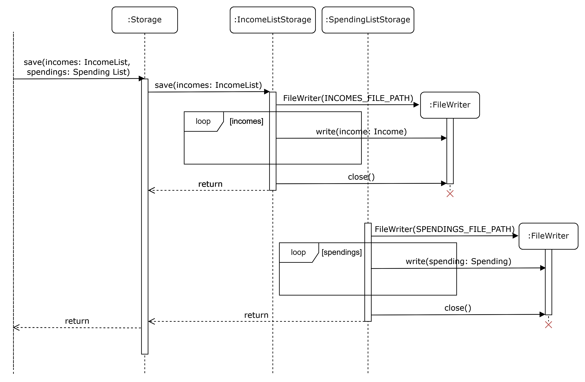
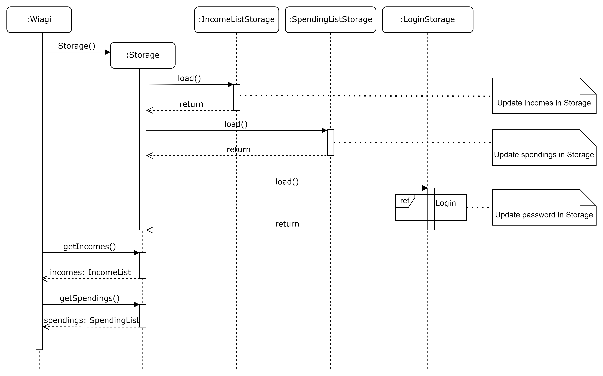
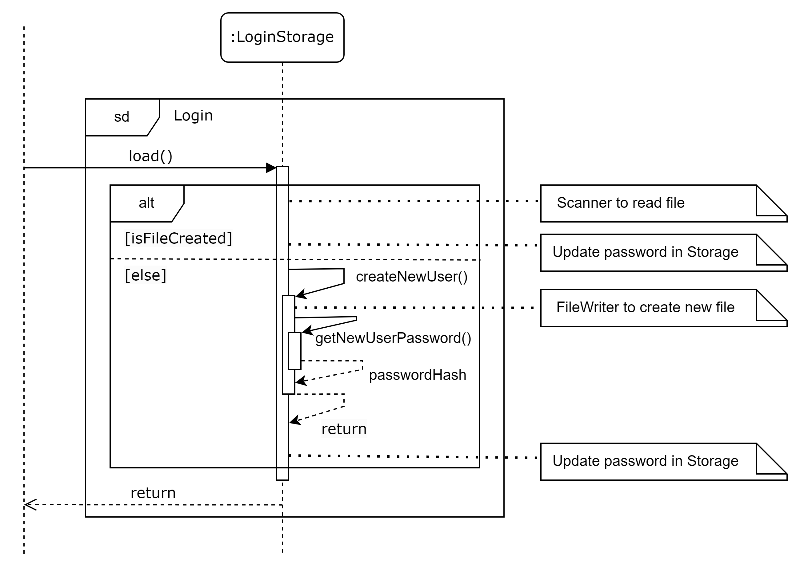
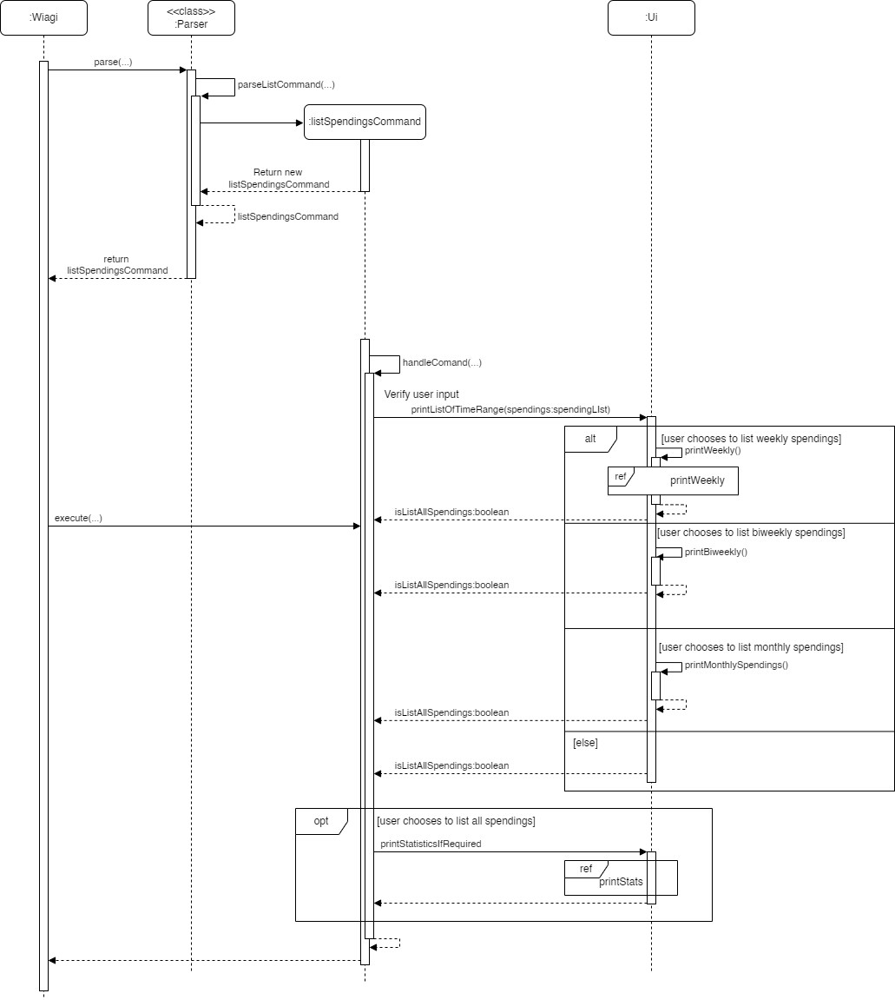
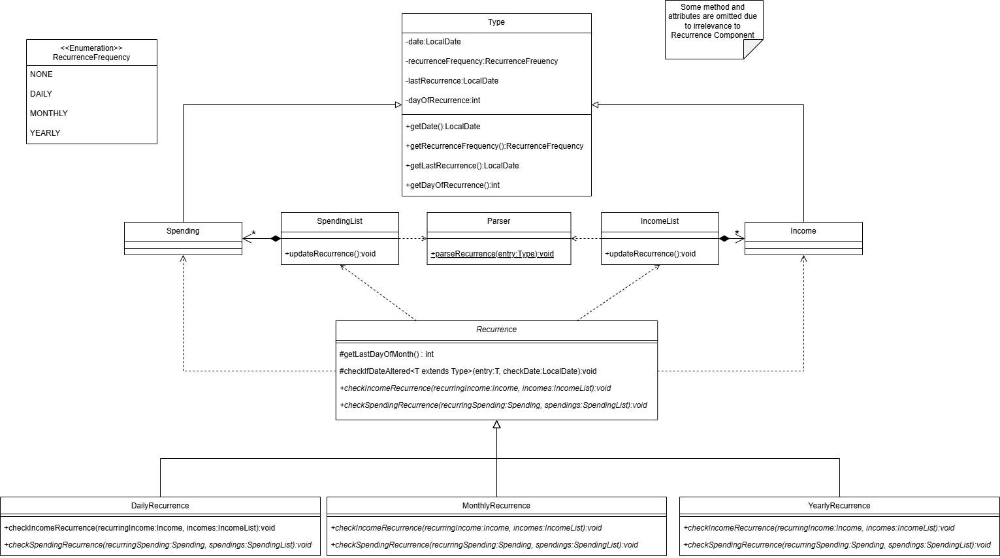
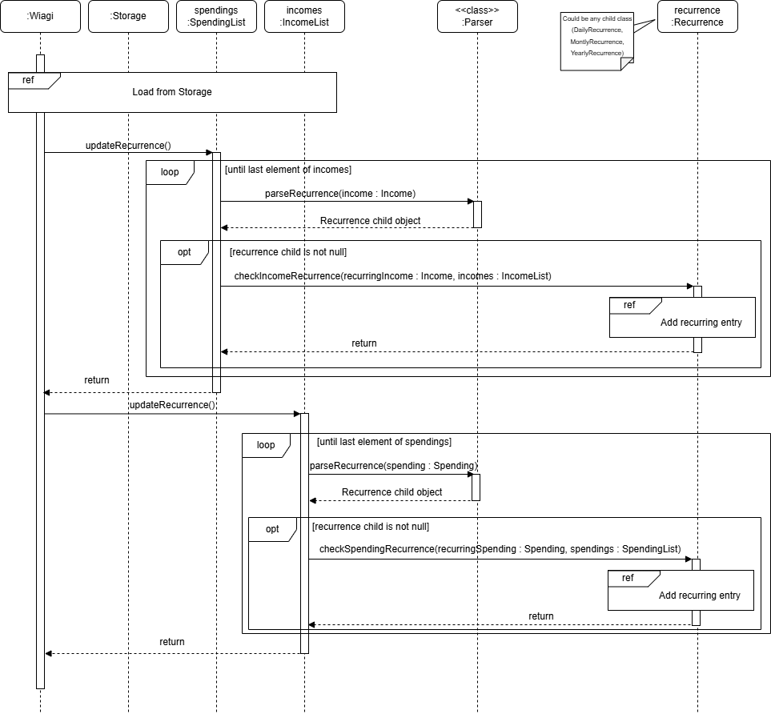

# Developer Guide

## Acknowledgements

{list here sources of all reused/adapted ideas, code, documentation, and third-party libraries -- include links to the
original source as well}

[Original Source](https://github.com/nus-cs2113-AY2425S1/tp)

## Design & implementation

{Describe the design and implementation of the product. Use UML diagrams and short code snippets where applicable.}

### Overall Class Diagram

<br>
On a high level, whenever `Wiagi` is started, it will load `SpendingList` and `IncomeList` from `Storage` if it exists, 
else, new lists would be created.
`Wiagi` then takes in user input via the `UI` class, then parse and executes the command through the `Parser` class.
The related output is printed through the `UI` class.
At the end of the run, or when the user exits the application, `Wiagi` will save the lists.
Now let's delve deeper into some of these classes used for the program below

#### EntryType Class
The `EntryType` class is a class that is used for storing different types of user entry such that the entries 
contain the relevant information required by other classes to perform their component tasks. <br>

The following are its attributes: <br>
+ `amount` (type `double`): stores the amount for the entry 
+ `description` (type `String`): stores the description of relating to the entry
+ `date` (type `LocalDate`): stores the date of entry 
+ `tag` (type `String`): stores the tag name linked to the entry
+ `recurrenceFrequency` ([type `RecurrenceFrequency`](#recurrencefrequency-enumeration)): stores the frequency of 
recurrence for the entry
+ `lastRecurrence` (type `LocalDate`): stores the date the entry was last recurred for internal program checking usage
+ `dayOfRecurrence` (type `int`): stores the day of it own private attribute `date`, used for internal program checking
usage

The methods implemented in this class are a collection of getters and setters that allow other class types to access
the information of the entry.

The following are child classes of `EntryType`:
+ `Income`: Stores entries that the user labels as income
+ `Spending`: Stores entries that the user labels as spending

#### Income class
The `Income` class inherits from `EntryType` class. It is used to store relevant information for entries labelled as 
income. This information was used by other classes to perform their component tasks.

#### Spending class
The `Spending` class inherits from `EntryType` class. It is used to store relevant information for entries labelled as
spending. This information was used by other classes to perform their component tasks.

#### IncomeList class
The `IncomeList` class inherits from the `ArrayList` class. It is used to store all of the `Income` objects used in the
program.

#### SpendingList class
THe `SpendingList` class inherits from the `ArrayList` class. It is used to store all of the `Spending` objects used in
the program. Additionally, it stores the budgets that are set by the user.

### Storage Component
#### Motivation behind the component:
+ Allows the user to save changes, so that they can resume where they left off.
+ Allows advanced users to edit files directly, enabling fast, manual adjustments.

#### How the Storage Component works:
+ Variables and File Path:
    + `incomes` → `./incomes.txt`
    + `spendings` → `./spendings.txt`
    + `password` → `./password.txt`

+ To save edited lists:
    + It is done when users type `bye` or after keyboard interrupts (i.e.Ctrl-c), which signals the end of the program.
    + The lists are saved to a user-editable format in their respective files.

+ To load saved lists:
  + It is done upon program startup, when `Wiagi` is constructed.
  + Within the `Wiagi` constructor, it will create a new instance of `Storage`, which will then load the data at the 
  `incomes` and `spendings` file paths to an `IncomeList` and `SpendingList` respectively.
  + `Wiagi` will then retrieve the lists in `Storage` to initialise its lists.
  + Data corruption in the file triggers an exception, often due to user-editing errors.
  + For missing files (e.g., new users), files are created and the initialised lists will be empty.

+ To load password:
  + The hashed password will simply be loaded from the password file.
  + For missing files (e.g., new users), users will be prompted to set a new password at the start of the
  program. The entered password will then be hashed and stored in a newly created password file.

#### Implementation:
#### Storage class
The `Storage` class is a class that stores `incomes`, `spendings` and `password`. 
Upon instantiation, it will call `IncomeListStorage.load()`, `SpendingListStorage.load()` and `LoginStorage.load()`, 
which will initialise the variables in `Storage` respectively.

#### save method in `IncomeListStorage` `SpendingListStorage`
<br>
Both classes have similar implementation for `save()`, except that `SpendingListStorage` saves budget details in the 
first line of its respective text file.
+ Format: `daily budget | monthly budget | yearly budget`
+ A for loop will loop through the list, and get each of the attributes of each entry within it and separate them by 
`|`. Hence, each entry will be written line by line to the file.
+ Format: `amount | description | date | tag | recurrence frequency | last recurrence date | last recurrence day`
  + E.g. `add income 10 part time /2024-10-10/ *job* ~monthly~` will be stored as
    `10.0|part time|2024-10-10|job|MONTHLY|2024-10-10|10`

#### load method in `IncomeListStorage` `SpendingListStorage`
<br>
Both classes have similar implementation for `load()`, except that `SpendingListStorage` also loads budget details.
+ A while loop will loop through the file with a scanner to read line by line till the end of the file is reached.
+ It splits each line by `|` to access each attributes, convert date and last recurrence date to `LocalDate` type, 
and add it to the lists.
+ During the process, if a line is corrupted, an exception will be caught and user will be informed.

#### load method in `LoginStorage`
<br>
+ It first checks if the password file exists.
  + If yes, it will use a scanner to read the file and initialise `password` in `Storage`.
  + Else, it will call `createNewUser()`, which creates a new password file and use `getNewUserPassword()` to scan for
  the user input. Then, it will be hashed, stored in the file, and be used to initialise `password` in `Storage`.

### Command handling component

#### Adding of new entry

<br>
To add new entries, user will have to input the related commands.
Wiagi will then parse the command to the AddCommand class.
The AddCommand class will then validate the user's input and add the input to IncomeList or SpendingList

#### Editing entries
The DeleteCommand validates and parses the given input to determine if it is editing a spending or an income. It then
uses the parsed input to determine which index of the SpendingList or IncomeList is to be edited, and extracts this 
entry from the list. Finally, it uses the parsed input to determine which attribute to edit and sets this attribute
of the extracted entry to the new value.

#### Deleting entries
The DeleteCommand validates and parses the given input to determine if it is deleting a spending or an income. It then
deletes the entry from the respective list(SpendingList or IncomeList) by calling the delete method of that list.

#### Creating a budget
The BudgetCommand first validates and parses the given input. It then determines whether the user wants to add a daily,
monthly, or yearly budget. It then calls the respective method of the SpendingList to set the correct budget.

#### Listing entries
Since there are various list commands that the user can execute, the list commands are split into multiple classes.
The parser then calls a separate function that will return the correct list command if the command word is `list`.

Since listing requires Wiagi to print items in the spendings and incomes list, these will be handled by the UI component.

The sequence diagram below shows what happens when the user executes a `list spendings` command.



### Recurrence Component

#### Motivation behind the component:<br>
+ Allows the user to set specific expenditure and incomes as recurring events to increase efficiency when using the
  application
+ Users may have differing frequencies for recurring events thus application gives them a few common options

Illustrated below is the class diagram for the Recurrence Component:<br>
<br>

<br>
<br>
Illustrated below is the sequence diagram of the Recurrence Component: <br>
<br>

<br>
For the reference frame of 'load from storage', refer to [Storage component](#storage-component). <br>
For the reference frame of 'add recurring entry', refer to 
[checkIncomeRecurrence / checkSpendingRecurrence](#checkincomerecurrence--checkspendingrecurrence-method) method. <br>

#### How the Recurrence Component works:<br>
+ Upon running the application by the user, `Storage` component will load the `IncomeList` and `SpendingList` members of
`Wiagi` to retrieve past data.
+ Both list are then iterated through. Each member of the list is parsed through `Parser` which returns the type of 
recurrence it is (e.g. `DailyRecurrence`, `null`) which is encapsulated as a `Recurrence` object.
+ If `Recurrence` is not `null` (i.e. a recurring entry), it checks the entry and adds to the `SpendingList` and 
`IncomeList` if needed. <br>

#### Implementation:
#### Recurrence class
The `Recurrence` class is an abstract class that provides the interface for checking `Income` and `Spending` and adding 
recurring entries into the list. <br>
The following are the abstract methods defined: <br>
+ `checkSpendingRecurrence`
+ `checkIncomeRecurrence`

The following are child classes of `Recurrence`:
+ `DailyRecurrence`: Handles entries labelled as daily recurring events
+ `MonthlyRecurrence`: Handles entries labelled as monthly recurring events
+ `YearlyRecurrence`: Handles entries labelled as yearly recurring events

##### RecurrenceFrequency enumeration
The `RecurrenceFrequency` enumeration is used to determine the type of recurring entry of `EntryType` and its child
classes <br>
Enumeration constants:
+ `NONE`: Represents a none recurring entry
+ `DAILY`: Represents a daily recurring entry
+ `MONTHLY`: Represents a monthly recurring entry 
+ `YEARLY`: Represents a yearly recurring entry

##### parseRecurrence method
Class: `Parser` <br>
Method Signature: <br>
```
public static Recurrence parseRecurrence(Type entry)
```
Functionality: <br>
1. Takes in child class of `Type` (i.e. `Spending`, `Income`)
2. Matches the `reccurenceFrequency` attribute with switch case to determine which `Recurrence` child to return
3. Returns `DaillyRecurrence`, `MonthlyRecurrence`, `YearlyRecurrence` or `null`(If not a recurring entry).

##### checkIncomeRecurrence / checkSpendingRecurrence method
Class: `DailyRecurrence`, `MonthlyRecurrence`, `YearlyRecurrence` <br>
Method Signature: <br>
```
@Override
public void checkIncomeRecurrence(Income recurringIncome, IncomeList incomes)
@Override
public void checkSpendingRecurrence(Spending recurringSpending, SpendingList spendings)
```
Below illustrates the functionality of the checkIncomeRecurrence method through a sequence diagram <br>
<br>
 <br>
Note that recurrence frequency is either 1 day (daily), 1 month (monthly) or 1 year (yearly). <br>
Since checkSpendingRecurrence method follows the same sequence as checkIncomeRecurrence method, the diagram is omitted 
for brevity.

Functionality: <br>
1. Checks `lastRecurred` attribute of `recurringIncome`/`recurringSpending` against the current date via `LocalDate.now`
2. According to the type of recurrence, check if enough time has passed between the 2 dates
3. Adds additional recurring entries into the `IncomeList`/`SpendingList` if needed.

##### updateRecurrence method
Class: `SpendingList`, `IncomeList` <br>
Method Signature:
```
public static Recurrence parseRecurrence(Type entry)
```
Functionality: <br>
1. Loops through its list and calls upon `Parser#parseRecurrence` to determine type of `Recurrence`
2. Calls upon `Recurrence#checkSpendingRecurrence` or `Recurrence#checkIncomeRecurrence` to update list if the new 
recurring entry is supposed to be added

#### Here are some things to take note:
+ Entries are only added when user logs in, which is not determinable, thus many additional entries may be added at once
(e.g. user last logged in 4 days ago with one daily recurring entry in the list. When the user logs in, 4 days of entries
will be backlogged and added). List is thus also sorted by date after recurrence is done.
+ Additional entries added by `Recurrence` are being set to not recurring events to prevent double recurring entries
added in the future
+ Recurring entries stores `dayOfRecurrence` to counter varying days in months. Below is an example scenario: 
  + Monthly recurring entry dated at 31st August
  + Since September ends on the 30th, recurring entry is added on the 30 September and `lastRecurred` is stored as 
  30th September
  + `dayOfRecurrence` is used to track the real date of recurrence since the day will be overwritten

### Budgets
Daily, monthly, and yearly spending totals are calculated everytime a ListCommand is received. This is done by
iterating through each of the spendings stored in SpendingList and comparing their dates to the respective daily,
monthly, and yearly dates.

### Deleting an entry
The user deletes an entry by sending a delete command which specifies the index of the income/spending to be deleted. 
The income or spending will be deleted from its corresponding list using its index. 


## Product scope
### Target user profile

{Describe the target user profile}

### Value proposition

{Describe the value proposition: what problem does it solve?}

## User Stories
Priorities: High (must have) - * * *, Medium (nice to have) - * *, Low (unlikely to have) - *

| Priority | As a ... | I want to ...                                        | So that I can ...                                |
|----------|----------|------------------------------------------------------|--------------------------------------------------|
| ***      | user     | start and close the application                      | use it only when needed                          |
| ***      | user     | add my financial transactions                        | track the flow of my money                       |
| ***      | user     | categorise my entries as income and spendings        | better understand my financials                  |
| ***      | user     | add income and expenditure categories                | see my overall net gain or loss                  |
| ***      | user     | see all my spendings                                 | know what I spent on                             |
| ***      | user     | delete my entries                                    | correct my mistakes                              |
| ***      | user     | have a password to my account                        | protect my account information                   |
| **       | user     | edit my incomes and spendings                        | correct my mistakes                              |
| **       | user     | categorise my expenses                               | see what I spend on                              |
| **       | user     | categorise my incomes                                | see where my savings come from                   |
| **       | user     | read the amount of money left in my allocated budget | gauge how much to spend for the remaining period |
| **       | user     | set expenses and incomes as recurring                | do not need to manually add them each time       |
| **       | Student  | set budgets for each category of expense             | make better financial decisions                  |
| *        | user     | be alerted when I overspend my budget                | try to curb my spendings                         |


## Use cases

### Use case: Add an Entry

**Adding an income entry with optional input for date and tag**

**MSS**

1. User inputs to add income with description, amount, date, and tag.
2. Wiagi adds the income to the income list.
3. If the date is not provided, Wiagi will use the current date.
4. If the tag is not provided, Wiagi will use the default tag (Empty String).
5. Wiagi will display a message to the user that the income has been added.

Use case ends.

**Extensions**
1. User enters invalid input.
   1. If the user inputs invalid formatting, Wiagi will display an error message.
   2. If the user inputs an invalid amount, Wiagi will display an error message.
   3. If the user inputs an invalid date, Wiagi will display an error message.
   
   Use case restarts at step 1.

### Use case: Delete an Entry

**Deleting an income or spending from the list**

**MSS**

1. User requests to list all incomes
2. Wiagi shows a list of all incomes
3. User takes note of the index of the income to delete and requests to delete the entry
by specifying the index
4. Wiagi deletes the entry
  
Use case ends.

**Extensions**
- 1a. The list is empty. 
<br>Use case ends. 
- 3a. The given index is invalid.
  - 3a1. Wiagi displays an error message.
<br>Use case restarts at step 1.


### Use case: Listing all Entries
**MSS**
1. User requests to list all entries.
2. Wiagi shows a list of all incomes and spendings, including optional parameters such as tags.

Use case ends.
**Extensions**
1. The list is empty.
    - 1a. Wiagi displays incomes and spendings without entries (equal to 0).

Use case of listing all spendings, incomes, tags is similar, omitted for brevity.


### Use Case: Edit an Entry
**Editing an existing income or spending entry**

**MSS**

1. User requests to list all incomes or spendings.
2. Wiagi shows a list of all incomes or spendings.
3. User takes note of the index of the entry to edit and requests to edit the entry by specifying the index and new details.
4. Wiagi updates the entry with the new details.
5. Wiagi displays a message to the user that the entry has been updated.

Use case ends.  
**Extensions**
1. The list is empty.
<br>Use case ends.
2. The given index is invalid.
    - 2a. Wiagi displays an error message.
    Use case restarts at step 1.
3. The new details are invalid.
    - 3a. Wiagi displays an error message.
    Use case restarts at step 1.

## Non-Functional Requirements

{Give non-functional requirements}

## Glossary

* *glossary item* - Definition

## Instructions for manual testing

{Give instructions on how to do a manual product testing e.g., how to load sample data to be used for testing}
